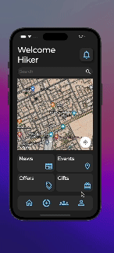

# Hike-SA

Hike-SA is an application developed at Tuwaiq Academy | أكاديمية طويق in flutter bootcamp.

## Video Overview



## Technologies Used

-   **Technologies and Frameworks:**
    -   Dart
    -   Flutter
    -   Supabase
    -   Google Cloud

## Installation

To get started with the Derby App, follow these steps:

1. Clone the repository:
    ```bash
    git clone https://github.com/Mustafaa71/Hike-SA.git
    ```
2. Navigate to the project directory:
    ```bash
    cd derby-app
    ```
3. Install the dependencies:
    ```bash
    flutter pub get
    ```

## Usage

To run the app on your local machine:

1. Ensure you have a device connected or an emulator running.
2. Use the following command to start the app:
    ```bash
    flutter run
    ```

## Contact

Don't hesitate to reach out with any inquiries or feedback. Please contact me at [m.almeer.swe@gmail.com](mailto:email@example.com).
